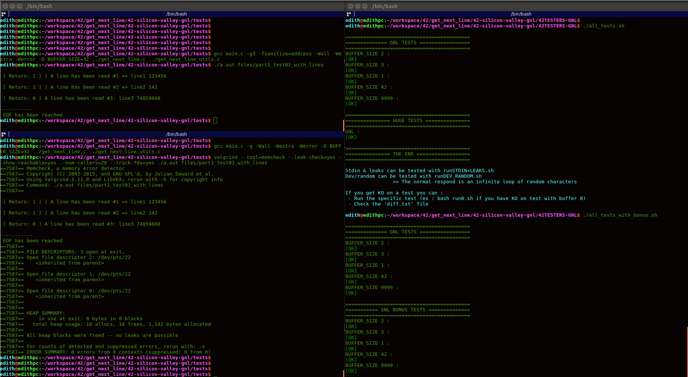

# Get Next Line (GNL)  :tractor:

The aim of this project is to make you code a function that **returns a line
ending with a newline, read from a file descriptor.**

This project will not only allow you to add a very convenient function to your collection,
but it will also allow you to learn a highly interesting new concept in **C programming:**
**"static variables"**

### Function Prototype
```c
int	get_next_line(int fd, char **line);
```
### Compilation

**GNL Mandatory Part**
Your program must compile with the flag -D BUFFER_SIZE=xx. which will be used
as the buffer size for the read calls in your get_next_line.

Make sure that your function behaves well when it reads from a file and when it
reads from the standard input.

Locate in the **42-silicon-valley-libft/test** folder.

**GNL with files**
```bash
gcc main.c -Wall -Wextra -Werror -D BUFFER_SIZE=32 ../get_next_line.c ../get_next_line_utils.c  -I ../

./a.out files/part1_test01_with_lines
```

**GNL with standard input (stdin)**
```bash
gcc main_stdin.c -Wall -Wextra -Werror -D BUFFER_SIZE=32 ../get_next_line.c ../get_next_line_utils.c -I ../

./a.out
```

**GNL Bonus Part**
```bash
gcc main_bonus.c -g -Wall -Wextra -Werror -D BUFFER_SIZE=1 ../get_next_line_bonus.c ../get_next_line_utils_bonus.c -I ../

./a.out
```

### Points to understand in GNL

According to our GNL subject "Calling your function get_next_line in a loop will then allow you to read the text
available on a file descriptor one line at a time until the EOF." 
Our GNL call seen from the main:

```c
fd = open(argv[1], O_RDONLY);
	while ((ret = get_next_line(fd, &line)) > 0)
	{
		printf(" \n [ Return: %d ] | A line has been read #%d => %s\n", ret, line_count, line);
		line_count++;
		free(line);
	}
```

This line will return an integer that will be used as a parameter for the **get_next_line** function.
```c
fd = open(argv[1], O_RDONLY);
```
Our **get_next_line** function will return an integer that will be taken to evaluate all the lines until the file ends.

### Return value
 | Number | Description         |
 |-----------|----------------------|
 | 1 | A line has been read |
 | 0 | EOF has been reached |
 | -1 | An error happened |


```c
#include <unistd.h>
ssize_t read(int fd, void *buf, size_t count);
```
**Input parameters:**
- int fd file descriptor is an integer and not a file pointer. The file descriptor for stdin is 0
- void *buf pointer to buffer to store characters read by the read function
- size_t count maximum number of characters to read

Note.: a character is equivalent to a 1 byte and a byte is made up of 8 bits therefore a character is made up of 8 bits (1 byte)

We can do something like this to read 20 bytes or 20 characters:
```c
char buffer[20];
read(STDIN_FILENO, buffer, 20);
```

Note.: remember read() doesn't add '\0' to terminate to make it string (just gives raw buffer).

## Some Basic Concepts

In fact, the C language treats all file streams equally, although some of the file streams may come from a disk or tape drive, from a terminal, or even from a printer.

Additionally, in C, there are three file streams that are pre-opened for you:
- stdin: The standard input for reading.
- stdout: The standard output for writing.
- stderr:The standard error for writing error messages.


## Valgrind

Install
```bash
sudo apt-get update -y
sudo apt-get install -y valgrind
```

Use
```bash
gcc main.c -g -Wall -Wextra -Werror -D BUFFER_SIZE=1 ../get_next_line.c ../get_next_line_utils.c
valgrind --leak-check=yes ./a.out mp_test01_with_file

valgrind --tool=memcheck --leak-check=yes --show-reachable=yes --num-callers=20 --track-fds=yes ./a.out
```


## Debug with GUI
```bash
gcc -g main.c -Wall -Wextra -Werror -D BUFFER_SIZE=1 ../get_next_line.c ../get_next_line_utils.c

lldb a.out

b get_next_line

run 01_test_with_file

gui

# keys

h
s
tab
directional key
```


## References

https://valgrind.org/docs/manual/quick-start.html


### Norminette
https://github.com/42sp/norminette-client

```bash
sudo apt-get install ruby ruby-bundler ruby-dev build-essential
git clone https://github.com/42sp/norminette-client.git ~/.norminette/
cd ~/.norminette/
bundle
```

```bash
echo 'alias norminette="~/.norminette/norminette.rb"' >> ~/.profile
source ~/.profile
```

Test Bonus Part


