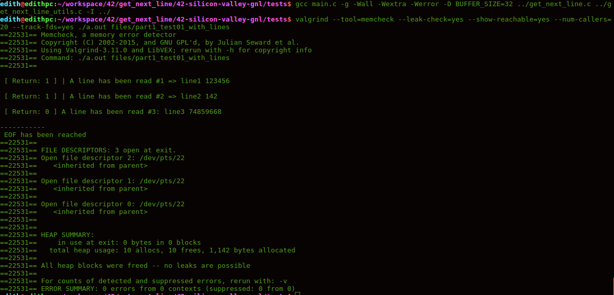
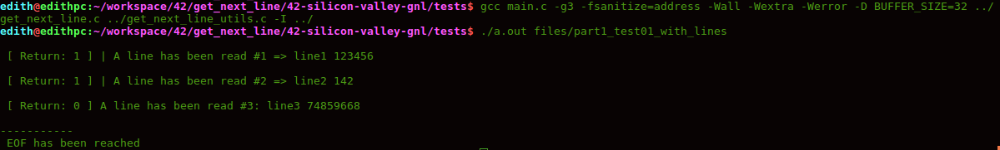
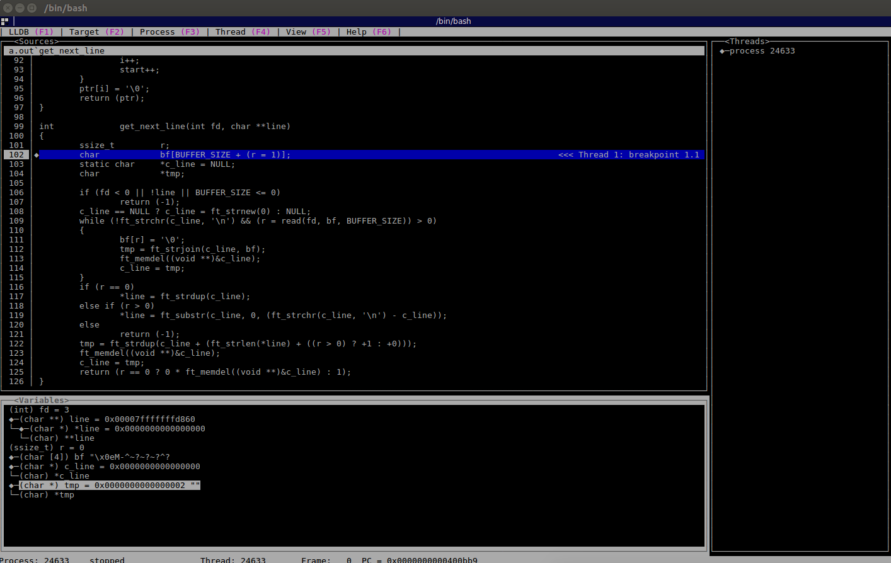

# Get Next Line (GNL)  :tractor:


The aim of this project is to make you code a function that **returns a line
ending with a newline, read from a file descriptor.**

This project will not only allow you to add a very convenient function to your collection,
but it will also allow you to learn a highly interesting new concept in C programming:
**"static variables"**

### Function Prototype
```c
int	get_next_line(int fd, char **line);
```
## Compilation

**GNL Mandatory Part**

Your program must compile with the flag -D **BUFFER_SIZE=xx**. which will be used
as the buffer size for the read calls in your get_next_line.

Make sure that your function behaves well when it reads from a file and when it
reads from the standard input.

 :point_right: Locate in the **42-silicon-valley-libft/test** folder.

**GNL with files**
```bash
gcc tests/main.c -Wall -Wextra -Werror -D BUFFER_SIZE=32 get_next_line.c get_next_line_utils.c

./a.out files/part1_test01_with_lines
```

**GNL with standard input (stdin)**
```bash
gcc tests/main_stdin.c -Wall -Wextra -Werror -D BUFFER_SIZE=32 get_next_line.c get_next_line_utils.c

./a.out
```

**GNL Bonus Part**
```bash
gcc tests/main_bonus.c -g -Wall -Wextra -Werror -D BUFFER_SIZE=1 get_next_line_bonus.c get_next_line_utils_bonus.c

./a.out
```

## Points to understand in GNL

According to our GNL subject *Calling your function get_next_line in a loop will then allow you to read the text
available on a file descriptor one line at a time until the EOF*

Call GNL from the main

```c
int main(int argc, char **argv)
{
	int fd, ret, line_count;
	char *line;

	line_count = 1;
	ret = 0;
	line = NULL;
	if (argc == 2)
	{
		fd = open(argv[1], O_RDONLY);
		while ((ret = get_next_line(fd, &line)) > 0)
		{
			printf(" \n [ Return: %d ] | A line has been read #%d => %s\n", ret, line_count, line);
			line_count++;
			free(line);
		}
		printf(" \n [ Return: %d ] A line has been read #%d: %s\n", ret, line_count++, line);
		printf("\n");
		if (ret == -1)
			printf("-----------\n An error happened\n");
		else if (ret == 0)
		{
			printf("-----------\n EOF has been reached\n");
			free(line);
		}
		close(fd);
	}
```

This next line will return an integer that will be used as a parameter for the **get_next_line** function.
```c
fd = open(argv[1], O_RDONLY);
```
**get_next_line** function will return an **integer** that will be taken to evaluate all the lines until the file ends.

### Return value
 | Value | Description         |
 |-----------|----------------------|
 |  1| A line has been read |
 |  0| EOF has been reached |
 |  -1| An error happened |

### READ() function

```c
#include <unistd.h>
ssize_t read(int fd, void *buf, size_t count);
```
**Input parameters:**
- **int fd** file descriptor is an integer and not a file pointer. The file descriptor for stdin is 0
- **void buf** pointer to buffer to store characters read by the read function
- **size_t count** maximum number of characters to read

**:traffic_light: Note.:** a character is equivalent to a 1 byte and a byte is made up of 8 bits therefore a character is made up of 8 bits (1 byte)

We can do something like this to read 20 bytes or 20 characters:
```c
char buffer[20];
read(fd, buffer, 20);
```

**:traffic_light: Note.:** remember read() doesn't add '\0' to terminate to make it string (just gives raw buffer).


### Functions Used

**External Functions**

  | Function | Description         |
 |-----------|----------------------|
 |  read() | A line has been read |
 |  malloc() | EOF has been reached |
 |  free() | An error happened |

**Utility Functions**

 | Function | Description         |
 |-----------|----------------------|
 |  ft_strnew() | Uses size as the size for a new string product of memalloc, this will return the new string, after assigning '' 0 "as elements of the string. |
 |  ft_strchr() | The  strchr() function returns a pointer to the first occurrence of the character c in the string s. |
 |  ft_strjoin() | Allocates with malloc and returns a new string, which is the result of the concatenation of 's1' and 's2'. |
 |  ft_memdel() | A line has been read |
 |  ft_strdup() | Returns a pointer to a  new  string  which  is  a duplicate  of the string s. |
 |  ft_substr | Allocates with malloc and returns a substring from the string 's'. |
 |  ft_strlen |  Calculates the length of the string s, excluding the terminating null byte ('\0') |


## Testers

### 42TESTERS-GNL
**Author:** Mazoise

 :point_right: Locate in the **42-silicon-valley-gnl** folder

```bash
git clone https://github.com/Mazoise/42TESTERS-GNL.git
cd 42TESTERS-GNL
./all_tests.sh
./all_tests_with_bonus.sh
```

### VALGRIND

**Installation**
```bash
sudo apt-get update -y
sudo apt-get install -y valgrind
```
**How to Use?**
```bash
gcc tests/main.c -g -Wall -Wextra -Werror -D BUFFER_SIZE=32 get_next_line.c get_next_line_utils.c

valgrind --tool=memcheck --leak-check=yes --show-reachable=yes --num-callers=20 --track-fds=yes ./a.out files/part1_test01_with_lines
```


**:information_source:** [ know more about valgrind ](https://valgrind.org/docs/manual/quick-start.html)

### FSANITIZE

```bash
gcc tests/main.c -g3 -fsanitize=address -Wall -Wextra -Werror -D BUFFER_SIZE=32 get_next_line.c get_next_line_utils.c -I

./a.out files/part1_test01_with_lines
```


## Other testers

[ GNL_lover ](https://github.com/charMstr/GNL_lover.git)   from *charMstr*

[ gnlkiller ](https://github.com/DontBreakAlex/gnlkiller.git)   from  *DontBreakAlex*

[ gnlkiller2 ](https://github.com/Sherchryst/gnlkiller.git)   from *Sherchryst*

## Debug with lldb and GUI
```bash
gcc -g tests/main.c -Wall -Wextra -Werror -D BUFFER_SIZE=1 get_next_line.c get_next_line_utils.c
lldb a.out
b get_next_line
run files/part1_test01_with_lines
gui
```
**:flashlight: keys to move**

- **tab** : change window
- **s** : next line
- **directional key** : variables navigation
- **h** : help




## Norminette

Use and install this repository: 
[ Norminette ](https://github.com/42sp/norminette-client.git)

**Run**
```bash
norminette *.*
```

## Graded by Moulinette


### GNL pdf  new curriculum
[Download from HERE](https://drive.google.com/file/d/1Dg5NWIZD0WmaiNZEp0-DjIkD22Og3e4A/view?usp=sharing)
 

